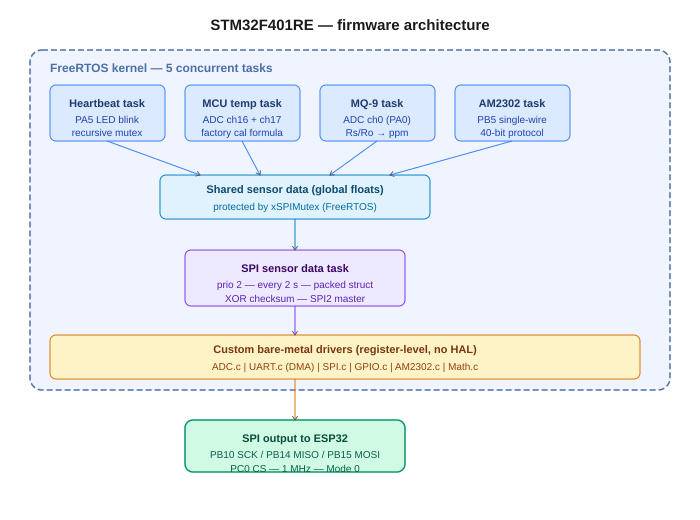

# Ecohive IoT Project

This project is a **sample IoT system** demonstrating environmental data collection, local monitoring, and cloud integration using **Bare-Metal C** and **FreeRTOS** on an STM32 microcontroller.  
The project is **developed and deployed using STM32CubeIDE**, with project management via **Jira** and version control via **Git**.

---

## 🧩 Overview

The system reads multiple sensors (gas, temperature, humidity) and sends their data to an **ESP32** via **SPI**.  
The ESP32 then transmits the collected data to the **AWS IoT Cloud** using **Wi-Fi (MQTT)** protocol.  
A UART terminal provides local monitoring, and a heartbeat LED indicates system health.  
All software development and deployment are done via **STM32CubeIDE**.

---

## 🗺️ System Architecture



---

## ⚙️ Hardware Requirements

| Component | Description |
|------------|-------------|
| **STM32 Nucleo-F401RE** | Main controller running Bare-Metal + FreeRTOS firmware |
| **ESP32** | Transfers data to AWS IoT via Wi-Fi and MQTT |
| **MQ9 Sensor** | Gas detection (CO, LPG, CH4) |
| **AM2302 Sensor (DHT22)** | Temperature and humidity measurement |
| **AWS IoT Platform** | Cloud monitoring and control interface |

---

## 🧠 System Details

### Sensor & Peripheral Connections

| Function | Pin | Description |
|-----------|-----|-------------|
| MQ9 gas sensor | `PA0 (ADC1_IN0)` | Analog input for gas concentration |
| Internal temperature sensor | `ADC1_IN16` | MCU die temperature via factory calibration |
| Internal voltage reference | `ADC1_IN17 (VREFINT)` | Used to compensate Vdda for accurate temperature reading |
| AM2302 sensor | `PB5` | Single-wire protocol — 40-bit data frame with checksum |
| Heartbeat LED | `PA5` | Blinks every 1.5 s as system health indicator |

---

### Communication Interfaces

| Interface | Pins | Description |
|------------|------|-------------|
| UART1 | `PA9 (TX)` | 115200 baud — sends sensor readings and heartbeat to PC terminal via DMA |
| SPI2 SCK | `PB10` | AF5 — clock output to ESP32 GPIO18 |
| SPI2 MISO | `PB14` | AF5 — data input from ESP32 GPIO19 |
| SPI2 MOSI | `PB15` | AF5 — data output to ESP32 GPIO23 |
| SPI2 CS | `PC0` | GPIO output — chip select to ESP32 GPIO5 |
| Wi-Fi + MQTT | — | ESP32 → AWS IoT Core over TLS port 8883 |

> **Note:** Earlier revisions of this project used PC2/PC3 for MISO/MOSI and PC10 for SCK. PC10 has no SPI2 alternate function on the F401 and caused the clock line to float. The correct SPI2 pins are PB10 (SCK), PB14 (MISO), PB15 (MOSI).

**Data flow:**  
`Sensors → STM32F401RE (Bare-Metal + FreeRTOS) → SPI2 (1 MHz, Mode 0) → ESP32 → Wi-Fi/MQTT/TLS → AWS IoT Core`

---

### SPI Frame Format

Data is transmitted as a 21-byte packed struct with an XOR checksum for integrity:

```c
typedef struct __attribute__((packed)) {
    float    mcu_temperature;    // °C — internal ADC with Vref compensation
    float    mq9_ppm;            // ppm — Rs/Ro power curve approximation
    float    am2302_temperature; // °C — DHT22 single-wire
    float    am2302_humidity;    // %RH — DHT22 single-wire
    uint32_t timestamp;          // ms — FreeRTOS tick × portTICK_PERIOD_MS
    uint8_t  checksum;           // XOR of all previous 20 bytes
} SensorData_t;
```

---

## 🧾 Features

- Developed entirely in **Bare-Metal C (register-level programming)** — no STM32 HAL used for peripheral drivers
- **FreeRTOS** handles five concurrent tasks with mutex-protected shared sensor data
- Each peripheral implemented in its own `.c` / `.h` driver file
- **Heartbeat LED (PA5)** and UART log confirm active operation at all times
- Data securely sent to AWS IoT Core via **ESP32 using MQTT over TLS 1.2**
- Software developed and deployed using **STM32CubeIDE**
- Project management with **Jira** and version control with **Git**

---

## 🧱 Software Stack

| Layer | Technology |
|-------|------------|
| MCU firmware | Bare-Metal C — register-level drivers |
| RTOS | FreeRTOS — tasks, mutexes, semaphores |
| Cloud protocol | MQTT over TLS 1.2 (via ESP32) |
| Cloud backend | AWS IoT Core |
| IDE | STM32CubeIDE |
| Project management | Jira |
| Version control | Git |

---

## 🧑‍💻 Author

**Hossein Baghaei**

---

## 🪄 Future Improvements

- Add OTA firmware updates via ESP32
- Build AWS IoT Rule → DynamoDB for persistent data logging
- Build AWS dashboard for real-time visualization
- Implement SD card data logging for offline analysis
